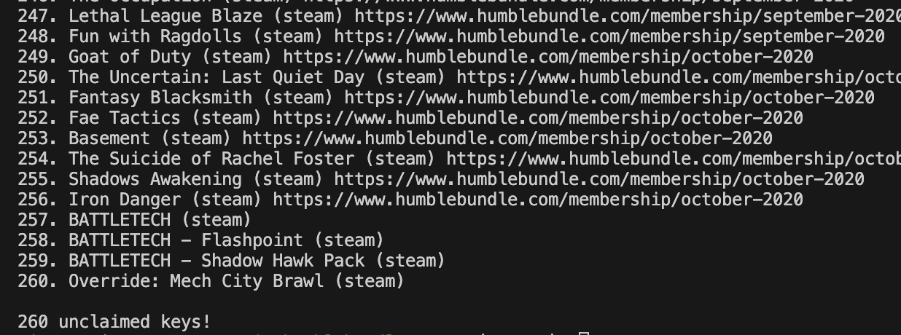

# humblebundle-games

Simple CLI tool to display all unclaimed keys you have on your humble bundle account.



```
Humble bundle keys

Usage: humblebundle-games [OPTIONS] --token <TOKEN>

Options:
  -t, --token <TOKEN>    _simpleauth_sess cookie value
  -s, --steamdb          adds steamdb info to parsable formats like json and csv
  -f, --format <FORMAT>  format to output data in [default: text] [possible values: json, csv, text]
  -h, --help             Print help
  -V, --version          Print version
```

## Usage

Find ``_simpleauth_sess`` cookie from browser and use it in token flag
```
git clone https://github.com/ayes-web/humblebundle-games
cd humblebundle-games
cargo run --release -- --token {YOUR COOKIE}
```


## Run with nix flake
```
nix run github:ayes-web/humblebundle-games -- --token {YOUR COOKIE}
```


## Output example

``
cargo run -- --format json --steamdb
``

```json
[
    {
        "key": "Boomerang Fu",
        "choice_url": "https://www.humblebundle.com/membership/february-2021",
        "platform": "steam",
        "url": "https://steamdb.info/app/965680/",
        "user_score": 91.03,
        "price_us": 14.99
    },
    {
        "key": "Werewolf: The Apocalypse — Heart of the Forest",
        "choice_url": "https://www.humblebundle.com/membership/february-2021",
        "platform": "steam",
        "url": "https://steamdb.info/app/1342620/",
        "user_score": 79.29,
        "price_us": 14.99
    },
    {
        "key": "Trine 4: The Nightmare Prince",
        "choice_url": "https://www.humblebundle.com/membership/february-2021",
        "platform": "steam",
        "url": "https://steamdb.info/app/690640/",
        "user_score": 87.31,
        "price_us": 29.99
    },
]
```